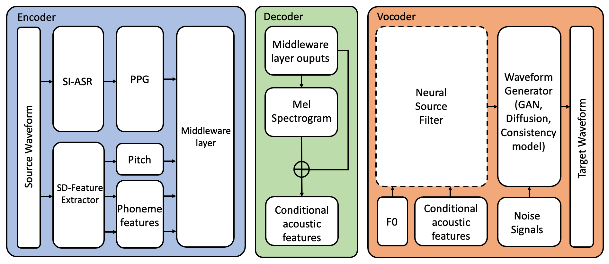
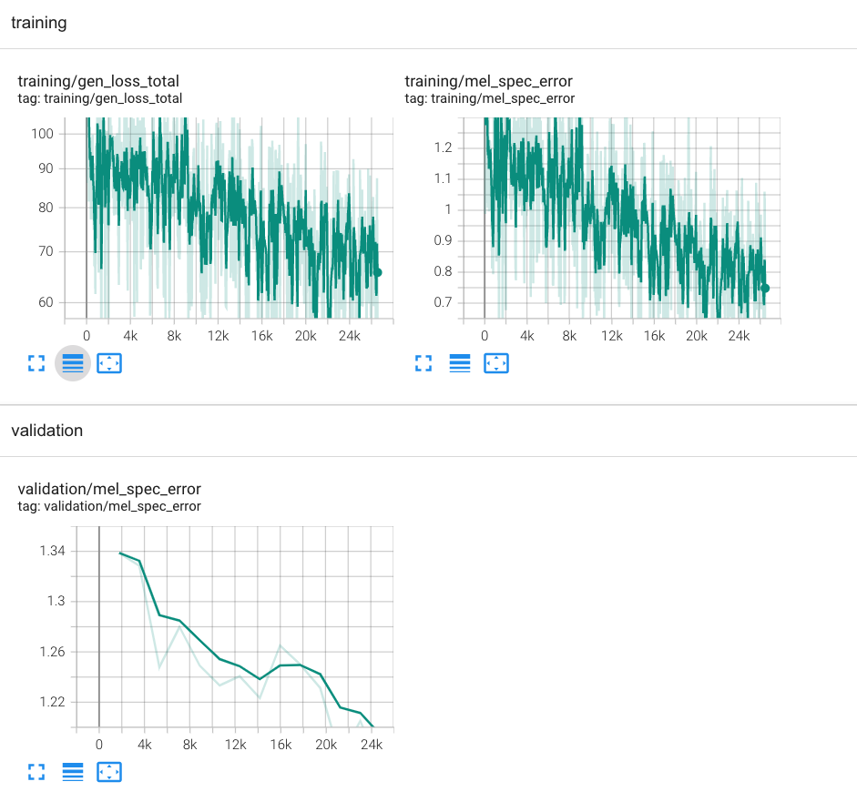

# CFMSinger: Improve Singing Voice Conversion via Fast Conditional Flow Matching
[](https://www.python.org/downloads/release/python-380/) [](https://pytorch.org/) [](https://huggingface.co/transformers/)  [](https://librosa.org/)


CFMSinger is a deep learning model that uses a conditional flow matching approach to improve the quality and sample speed of a many-to-many singing voice conversion. The model is intended to outperform two baseline models based on GAN and Diffusion vocoder in terms of audio quality and inference speed from a source singer to the target singer.


## Installation
1. Clone the repository
```bash
git clone https://github.com/yourusername/CFMSinger.git
cd CFMSinger
```
2. Install the required packages:
```bash
pip install -r requirements.txt
```

## Model Architecture
The proposed model architecture is shown in the following diagram:


## Usage
### Config and Preprocess
```bash
cd preprocess
python processs_opencpop.py # extract train json
python process_m4singer.py  # extract test json
python extract_whisper.py   # extract ppg
python extract_lf0.py
python extract_hubert.py    # extract phoneme
```


### Training
To train the GAN and Diffusion vocoder baseline models, run:
```bash
python train_gansvc.py
python train_diffsvc.py
```

To train the CFMSinger model run:
```bash
python train_cfmsvc.py
```

### Inference
To generate audio using a trained model, run:
```bash
python inference.py --model_path path/to/model --input_path path/to/input --output_path path/to/output
```

## Results
The following figures show the results of our experiments:

### Audio Samples

<!-- | Audio File | Groundtruth |  Generated  | Conversion  |
|------------|-------------|-------------|-------------|
| HIFI-GAN   | <audio controls>
  <source src="assets/gt_clip3.wav" type="audio/wav">
</audio> |<audio controls>
  <source src="assets/GAN_pred_clip3.wav" type="audio/wav">
</audio>| |
| DiffWave   |            | | |
| CFM        |            | | | -->

### Mel Spectrograms


### Scalar Values


## License
This project is licensed under the MIT [License](LICENSE) - see the LICENSE file for details.
